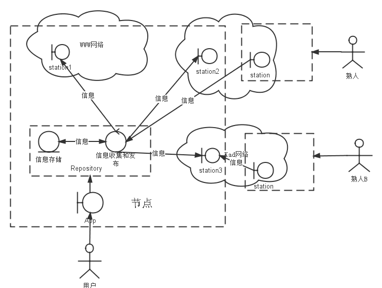

## 小行星信息网络 （Asteroid Network）
**黑的宇宙中，我们倾听彼此。**

### 分布式信息共享网络

   * 人们无法删除信息。
   * 人们无法关闭网络。
   * 人们无法控制信息流向。
   * 人们发出的信息不可否认。
   
### 原理

网络由一个全局的数据集和一些可以操作这个数据集的节点组成，节点由用户建立和维护，用户通过节点访问数据。关于数据集和节点的约定如下：

* 节点是平等的。
* 数据集由分散在各个节点中的数据组成，各节点持有一部分数据。
* 各节点知道其他一部分节点，并与它们联系。
* 节点可以随时建立和消亡。节点间的关系可以随时建立和切断。
* 数据通过节点间的复制实现传递。
* 数据无法被删除，也无法被更改。
* 数据可能丢失——
	* 网络和节点的运行不依赖于任何特定的数据。
	* 节点间优先传递人们感兴趣的数据。未在节点间传递的数据自然丢失。

		
### FQA
* Q：我必须使用一个特定的软件才能使用网络中的信息么？  
A： 不需要，任何遵循“原理”的手段都可以访问网络中的信息。可以是一个特定的程序，也可以是一些手工操作，也可以自己构建喜欢的程序来访问。
* Q：我不能看到所有的信息？  
A：用户不需要看到所有信息，只需要看到感兴趣的信息。
* Q：我的节点必须“在线”么？  
A：不需要，需要从别的节点得到信息时，与这个节点建立联系即可。联系的方式由自己的节点和对方节点自行约定。
* Q：信息在网络中是如何传播的？  
A：简述如下：  
	1. 用户产生信息，对信息进行签名，保存在自己的节点。 
	2. 熟人节点跟用户节点联系，发现有新的信息，复制到熟人节点。同时熟人可以阅读到这个信息。
	3. 熟人的熟人节点跟熟人节点联系，发现有新信息，复制到自己的节点。同时熟人的熟人可以阅读到这个信息。
	4. （以此类推。）
* Q：我的节点如何知道其他节点？  
A：每个节点都有一个能描述如何联系自己的地址，可以被发布在任何地方，比如个人网站、微博、微信、qq等等，用户从这些途径获得信息后，就可以跟相应节点进行联系。同时节点地址跟其他信息一样，也在网络中传播。所以一个节点可以从跟其他节点获得更多陌生节点的信息，从而按需与这些节点联系。
	
   
### 参考实现

* 数据实现为json 对象。
	* //TODO 完成文档
* 节点的实现大致分为三个部分：app，repository，station
	* app - 负责展示、撰写信息以及其他与用户交互的功能。
	   * 展示和撰写被共享信息，必要时进行加密解密、签名和验证。
	   * 管理系统的状态和配置。
	* repository - 负责容纳，管理信息和元数据。
	   * 容纳信息，包括被共享的信息，其他用户的信息，自己的配置信息，以及其他可能的元数据。
	   * 收集和交换上述各类数据。
	* station - 负责与其他用户沟通。station这个名字来源于Asteroid这个名字，比喻为行星间保持通讯的空间站。全名space station
	   * 负责用户间的连通性，当repository需要时负责与其他repository沟通。
	   * 连通性可以借助各种网络达成，比如WWW，Kad，Gnutella等。
	   * 实现连通性的方式是将自己暴露在一个可以访问的地址，等待其他节点访问。比如WWW上的一个url。
	   * station可以同时承担从其他节点收集信息的任务，但不是必须的。

* 参考实现结构综述如下图。
	
